# Top 12 Home Fragrance Brands Ranked in 2025 (Latest Compilation)

Finding the right home fragrance brand can transform your living space from ordinary to extraordinary. Whether you're looking for clean-burning candles, flameless wax warmers, or long-lasting scents that actually fill a room, the market offers dozens of options at different price points and quality levels. Many people struggle with candles that tunnel, produce black soot, or lose their scent throw after a few burns. This guide cuts through the confusion by highlighting established home fragrance companies that deliver on quality, variety, and customer satisfaction. From traditional jar candles to innovative fragrance systems, these brands have proven track records in creating inviting atmospheres that turn houses into homes.

***

## **[PartyLite](https://www.partylite.com)**

Premium candles and home fragrance with five decades of craftsmanship expertise.

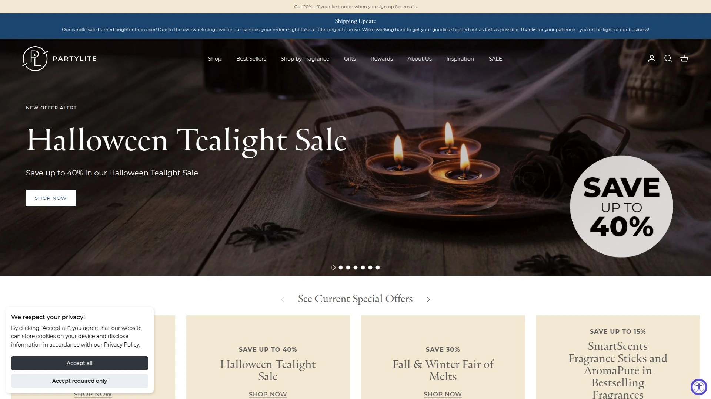

PartyLite stands as a pioneer in the home fragrance industry since 1973, originally revolutionizing how candles reached consumers through innovative social selling before transitioning to a modern direct-to-consumer model in North America as of March 2024. The brand maintains its position as a global leader in candles, home fragrance, and decor accessories with operations across 19 countries.

**Product Range and Quality**

The company offers an extensive collection including seasonal candles, candle accessories, flameless fragrance options, and wax warmers. Their commitment to clean, sustainable ingredients sets them apart—products are formulated with natural, ethically produced materials that prioritize environmental consciousness and customer well-being. Every candle reflects decades of refinement in scent development and burn quality.

**Why Choose PartyLite**

Beyond product quality, PartyLite's longevity demonstrates adaptability and customer focus. The transition to direct-to-consumer sales with a Brand Ambassador program shows responsiveness to modern shopping preferences while maintaining support systems for former consultants. Their unwavering commitment to innovation and customer satisfaction positions them for another fifty years of success in the home fragrance market.

---

## **[Yankee Candle](https://www.yankeecandle.com)**

America's largest candle manufacturer with over 150 signature fragrances.

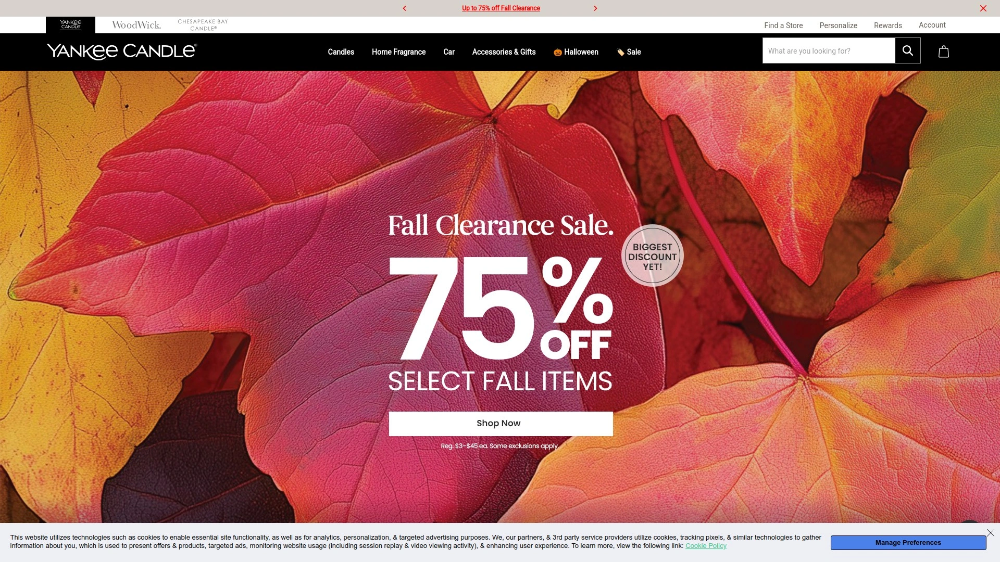

Founded in 1969 when sixteen-year-old Mike Kittredge melted crayons to create his mother's Christmas gift, Yankee Candle has grown into the country's best-selling candle brand. Headquartered in South Deerfield, Massachusetts, the company operates 217 small-box format stores across 37 U.S. states and Ontario, with products sold in nearly 50 countries worldwide.

The brand's master chandlers handcraft the majority of candles in Massachusetts, ensuring consistency and quality control. Their product line spans over 150 fragrances across seasonal and specialty scented candles, home fragrance products, car air fresheners, and candle accessories. Distribution reaches thousands of gift shops, specialty retailers, catalogs, and online platforms, making Yankee Candle accessible regardless of shopping preference.

What distinguishes Yankee Candle is its massive retail footprint combined with wholesale reach to over 19,000 specialty retailers in the U.S.. This dual approach ensures customers can experience fragrances in-store before purchasing or shop conveniently online. The brand's fund-raising division also supports schools and organizations, extending its impact beyond commercial sales.

***

## **[Bath & Body Works](https://www.bathandbodyworks.com)**

America's most-loved candle brand with room-filling 3-wick candles.

Bath & Body Works dominates the home fragrance market with its signature 3-wick candles that deliver approximately 25-45 hours of burn time. The exclusively fragranced soy wax blend contains high concentrations of rich fragrance oils, creating the room-filling experience the brand is famous for. With over 100 fragrances available, customers find options for every mood, season, and aesthetic preference.

**Product Innovation**

Beyond traditional candles, the company offers Wallflowers plug-in diffusers with Scent Control technology featuring three intensity levels for customizable fragrance strength. Room sprays provide instant refreshment with just two quick bursts, while car fragrances deliver four to six weeks of continuous scent for on-the-go experiences. The recent ceramic candle collection merges functionality with home decor style.

Single wick candles provide 30-50 hours of burn time for smaller spaces or lighter fragrance preferences. Aromatherapy candles target specific moods and wellness goals. The brand's minimal aesthetic ensures candles complement rather than clash with existing decor, with coordinating candle holders and accessories available to complete any room's look.

***

## **[Scentsy](https://scentsy.com)**

Flameless fragrance leader with wickless wax warmers and over 170,000 consultants globally.

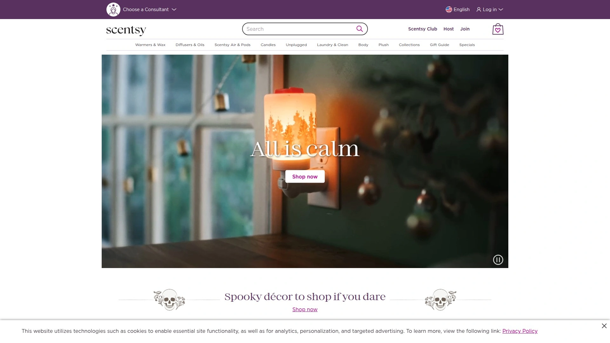

Scentsy revolutionized home fragrance by prioritizing safety through flameless electric wax warmers that deliver beautiful, soot-free and smoke-free fragrances. Founded in 2003 and relaunched in 2004 under new ownership with a multi-level marketing distribution model, the company expanded from Salt Lake City to establish headquarters in Meridian, Idaho.

The product ecosystem includes wax warmers, scented wax melts, diffusers with adjustable color and light settings, portable fragrance systems, and air purification products. Diffusers provide instant, all-natural scents with complete personal customization of fragrance strength. In 2017, the company reported over $450 million in annual sales, ranking as number 44 on Direct Selling News' list of top direct selling companies worldwide.

Scentsy operates in multiple countries including Canada, the United Kingdom, and Germany, with a strong consultant network that had over 170,000 active independent consultants at its peak. The company opened an east coast distribution center in Rock Hill, South Carolina in 2021 to improve fulfillment efficiency. Their 2023 partnership with Disney for "Smellephants on Parade" demonstrates continued innovation and brand collaborations.

***

## **[Voluspa](https://voluspa.com)**

Handcrafted luxury candles with clean-burning coconut wax blend made in California.

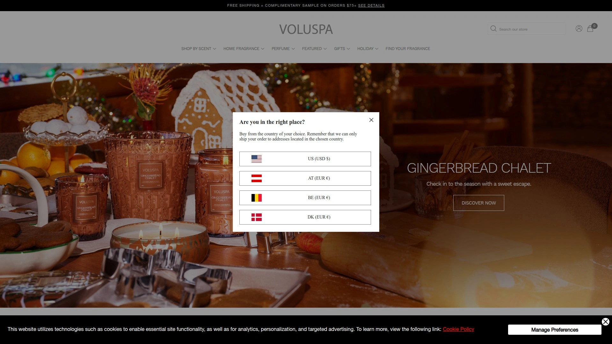

Voluspa positions itself in the premium candle segment with products handcrafted in California using a proprietary coconut wax blend. The 30 oz. Luxe Candles feature three natural wicks providing approximately 80 hours of burn time, housed in elegant glass vessels with matching lids that double as bases when lit. Every product is free of phthalates, pesticides, parabens, and sulfates, and never tested on animals.

Fragrances like French Linen evoke sensory experiences such as drifting into slumber in sun-dried sheets, blending Solar Amber, Cotton Flower, Sun Dried Vanilla Bean with Citrus Peel and White Cedar. Suede Blanc wraps spaces in soft, supple comfort with sultry, smooth sensuality. The thoughtful scent compositions create atmospheric transformations beyond basic fragrance.

The vessels themselves become keepsakes after the last burn, encouraging upcycling as decorative pieces. This attention to sustainable practices and reusable design appeals to environmentally conscious consumers. Complimentary shipping on orders $75 and above, plus luxury samples included in qualifying orders, enhance the premium purchasing experience.

***

## **[WoodWick](https://woodwick.yankeecandle.com)**

Crackling wooden wick candles that recreate the cozy ambiance of a fireplace.

WoodWick Candles distinguish themselves through Pluswick Innovation technology—natural wooden wicks that crackle as they burn, creating the soothing sound of a crackling fire. The soy and paraffin wax blend ensures cleaner, smoke-free burning with a dancing flame that provides both auditory and visual appeal. This unique sensory experience brings hearth-like warmth to any room regardless of season.

**Collection Variety**

The Hourglass Collection features consistent, even burns starting at 40 hours for Mini candles and extending up to 160 hours for larger sizes. Trilogy Collection candles layer complementary fragrances for 75-160 hours of burn time depending on size. Hearthwick candles provide approximately 50 hours while Petite sizes offer around 7 hours for sampling scents.

Popular fragrances include Fireside, Frasier Fir, and Linen among over 15 different scent options. The premium wax mixture ensures even burning throughout the candle's life, eliminating common issues like tunneling. WoodWick's focus on recreating the comforting feeling of gathering around a hearth makes these candles particularly appealing during colder months or for creating cozy atmospheres year-round.

***

## **[NEST New York](https://www.nestnewyork.com)**

The number one prestige home fragrance brand in the United States.

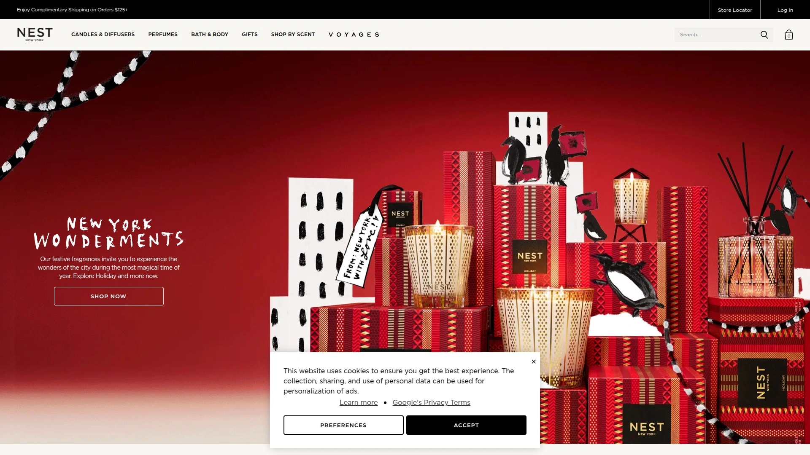

NEST New York holds the distinction of being the #1 Prestige Home Fragrance brand in the U.S. and ranks as a top 10 Fine Fragrance brand at Sephora North America. Launched in 2008 by fragrance authority Laura Slatkin, the brand has captured hearts and households through outstanding product quality, extraordinary fragrances, and timeless classic design. Products span home fragrance, fine perfumes, personal care, and fragrance technology innovations.

The brand recently celebrated five consecutive wins at The Fragrance Foundation Awards, with Sunlit Yuzu & Neroli taking home Candle & Home Collection of the Year in 2025. Vanilla Bourbon was a Fragrance of the Year finalist, while Madagascar Vanilla Body Mist earned Consumer Choice finalist recognition. These accolades validate the brand's commitment to fragrance excellence and collaboration with master perfumers at Givaudan.

NEST's new VOYAGES collection represents luxury redefined, offering transportive fragrances that conjure rarified places and evocative memories through Eau de Parfums, Perfume Oils, Candles, and Diffusers. Currently sold primarily in North America through specialty stores, luxury department stores like Bergdorf Goodman, Sephora, Ulta Beauty, boutiques, and online, the brand is expanding into the UK and Middle East with global rollout planned.

---

## **[Gold Canyon](https://www.goldcanyon.com)**

Premium soy candles poured in the USA with clean-burning formulas.

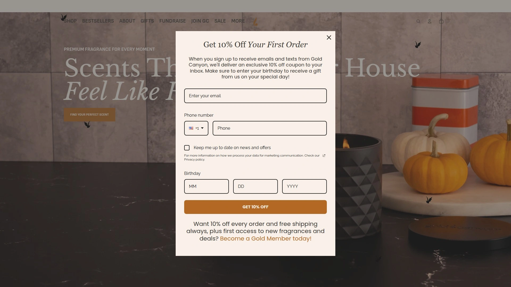

Gold Canyon specializes in 100% soy wax candles free of additives and sulfates, ensuring cleaner, more even top-to-bottom burns without toxins. The brand prides itself on sourcing materials from American manufacturers and farmers, with all candles poured in the USA. A portion of proceeds supports organizations championing mental health awareness, aligning profits with purpose.

The company's fragrance library spans Woodsy, Fruity & Floral, Spicy & Warm, and Citrusy scent profiles, offering variety for different preferences and seasonal moods. Classic scents and luxury fragrances cater to customers seeking both familiar comfort and elevated experiences. The commitment to healthier ingredients demonstrates responsiveness to consumer demand for safer home products.

After the original Gold Canyon company closed abruptly in spring 2020, devoted fans and former consultants launched Canyon Scents to continue the legacy of quality candles. This dedication to preserving the brand's reputation for legendary scents and superior burn quality speaks to the loyal customer base Gold Canyon cultivated. The reborn brand maintains the high standards that made the original company beloved.

***

## **[Pink Zebra Home](https://pinkzebrahome.com)**

Unique sprinkle wax system with customizable fragrance blending options.

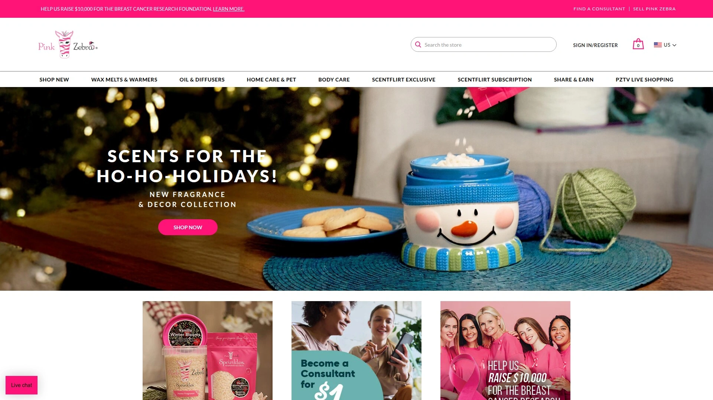

Pink Zebra Home offers an innovative approach to home fragrance with its proprietary "Sprinkles" wax system that allows customers to blend fragrances and create custom scent combinations. The company operates with independent consultants who host parties, sell products online, and build teams, earning up to 30% in commissions on personal sales. This business structure empowers individuals while providing flexible income opportunities.

**Community and Values**

The company emphasizes giving back by supporting single mothers with days of daycare, purchasing from American farmers for soybeans and essential oil sources, and providing veterans with local jobs. Consultants gain leadership skills, achieve goals, and access incentive trips to destinations like Costa Rica, Cabo San Lucas, and Ireland. This community-focused approach builds connections beyond transactions.

The product line includes wax melts, warmers, fragrance options, and home decor items accessible through independent consultant websites or by finding local representatives. New consultants receive business tools, training through PZ Academy, and Facebook community support to launch successfully. The ScentFlirt subscription service offers convenient recurring deliveries for favorite fragrances.

***

## **[Boy Smells](https://boysmells.com)**

Gender-neutral luxury candles with complex, unconventional scent profiles.

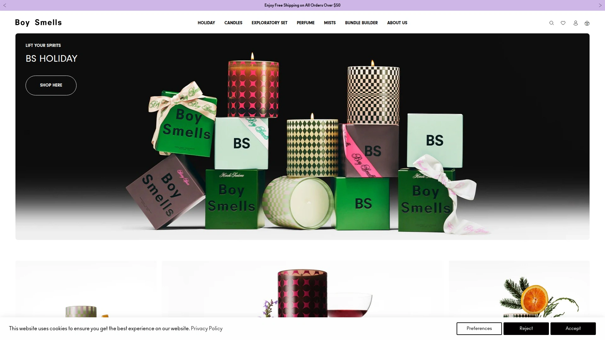

Boy Smells brings attitude to home fragrance with its anti-vanilla, non-basic approach to scent creation. The brand's Vanilla Era candle reimagines timeless vanilla with depth and edge through golden amber, fresh tulip, rich espresso, and pink pepper for a sweet-but-spicy gourmand experience. Each fragrance features complex, unique compositions that challenge traditional candle scent expectations.

The recently updated wax formulation uses vegan, non-GMO soy blend from US farms with approximately 50 hours of burn time. This new blend enhances fragrance throw to fill entire homes, reduces tunneling risk for even burning, and eliminates sooting while maintaining perfect flame quality. Customers report amazing projection and very complex scents that make these favorites despite requiring occasional foil attention during burning.

Inspired by the brand's rich LGBTQ+ history, the Essentials Line pays homage to past Pride and limited-edition collections both visually and olfactively. Scents like Roasted buzz with black currant, jasmine and coffee absolute. The brand operates a flagship store at 268 Elizabeth Street in NYC, offering in-person shopping Monday-Saturday 11-7 and Sunday 12-6. Boy Smells creates "Scents for All Sides of You," turning daily routines into meaningful rituals.

***

## **[DW Home Candles](https://www.dwhome.com)**

Hand-poured richly scented candles with over 500 fragrance options.

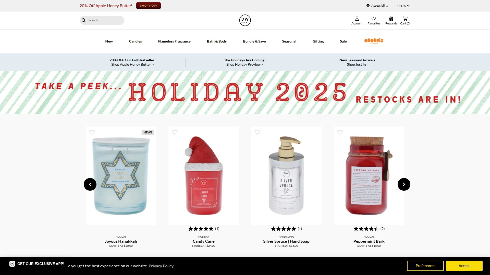

DW Home Candles delivers impressive variety with over 500 scents spanning Woodsy, Fruity & Floral, Spicy & Warm, and Citrusy fragrance families. Every candle is hand-poured with attention to detail and designed with love, earning the brand recognition as "the candle aisle's fave". The extensive selection ensures customers find perfect matches for any preference, mood, or occasion.

Large double wick candles provide approximately 56 hours of burn time with dimensions of 3.92" x 6.52" and fill weight of 14.9 oz. Seasonal releases keep the lineup fresh while best sellers maintain consistent availability. The brand's active social media presence showcases customer "DW hauls" and five-star reviews, building community around shared fragrance enthusiasm.

DW Home emphasizes clean-burning formulations free of toxins, with products poured in the USA. The brand also offers flameless options for those preferring wax warmers or electric fragrance systems. Generous rewards programs and regular promotions make premium candles accessible at various price points. Their behind-the-scenes content and candle care tips help customers maximize burn quality and fragrance longevity.

---

## **[Mia Bella Candles](https://miabellasgourmetcandles.com)**

Triple-scented gourmet candles made with natural palm wax for clean burning.

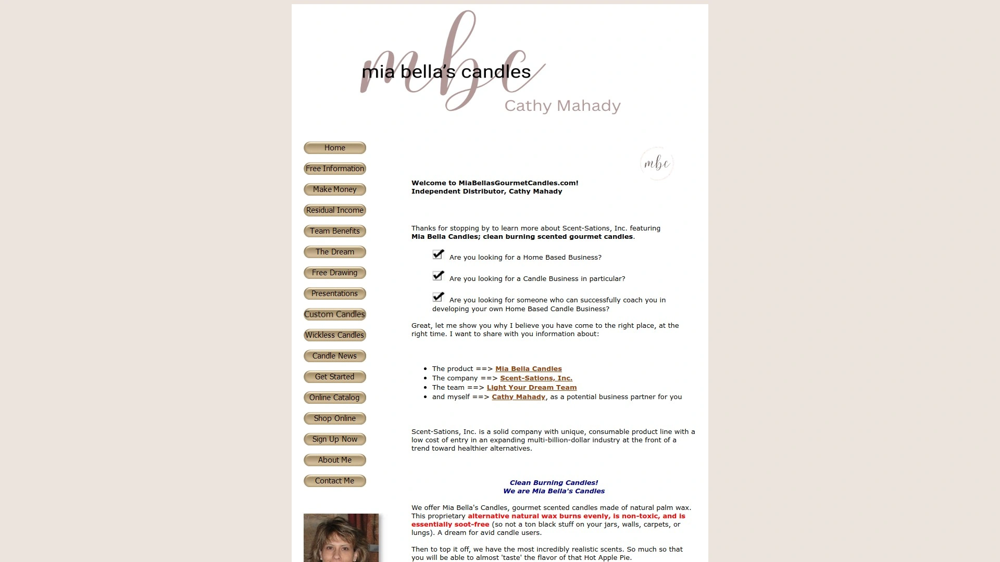

Mia Bella Candles by Scent-Sations, Inc. positions itself as the cleaner alternative to traditional paraffin candles. The proprietary palm wax formula burns evenly, is non-toxic, and practically soot-free—eliminating the black residue that paraffin candles leave on jars, walls, carpets, and potentially lungs. This health-conscious approach appeals to avid candle users seeking safer options for frequent burning.

**Triple-Scented Experience**

The triple-scenting process creates incredibly realistic fragrances—customers report almost being able to "taste" scents like Hot Apple Pie. Beyond traditional wicked candles, the flameless Mia Melts collection offers wax melts compatible with any warmer, providing exceptional fragrance without flames. Founded in 1999, Scent-Sations, Inc. represents a solid company with unique, consumable product lines at the front of trends toward healthier alternatives.

The candle industry represents nearly $3 billion annually, with candles or melts burned in 8 out of 10 homes in the U.S.. Sixty-seven percent use candles at least once a week, making them highly consumable products that customers repurchase over time. Mia Bella's simple "Smell and Sell" demonstration model helps distributors introduce products effectively. The company's flexible business approach never requires hosting home parties or meeting sales quotas.

***

## **[Aromatique](https://www.aromatique.com)**

Where fragrance becomes art through decorative scents and botanicals.

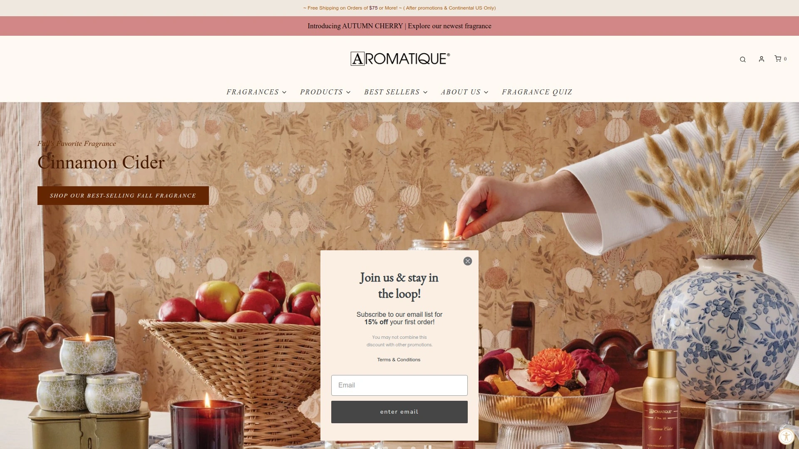

Aromatique elevates home fragrance beyond candles into artistic expressions that blend scent with visual beauty. The brand's tagline "where fragrance becomes art" reflects its unique position combining decorative fragrance products with traditional candles and wax melts. Product categories span Citrus + Fruits, Warm + Woods, and Fresh + Floral fragrance profiles alongside specialized formats.

The company offers decorative fragrance bowls with refresher oils, room sprays, diffusers, candles, wax melts, and complementary accessories. The newest Autumn Cherry fragrance showcases seasonal innovation. This multi-format approach allows customers to layer fragrances throughout homes using different delivery methods for comprehensive scent experiences.

Aromatique's decorative fragrance products serve dual purposes—beautifying spaces while scenting them. Botanical elements add visual interest to coffee tables, mantels, and entryways while releasing continuous fragrance. The refresher oil system extends product life, making these pieces sustainable choices. This artistic approach to home fragrance appeals to customers who view scent as integral to interior design rather than merely functional.

***

## FAQ

**What makes clean-burning candles better than regular paraffin candles?**

Clean-burning candles made from soy, coconut, or palm wax produce minimal to no black soot, unlike petroleum-based paraffin candles that release residue onto walls, jars, and into air. These natural waxes burn more evenly with longer burn times while being non-toxic and better for indoor air quality, especially important for frequent candle users or those with sensitivities.

**How can I make my candles last longer and burn more evenly?**

Always trim wicks to 1/4 inch before each lighting to prevent smoking and uneven burning. On the first burn, allow the entire wax surface to melt completely—minimum 3 hours for most candles—to establish proper wax memory and prevent tunneling. Never burn candles for more than 4 hours at a time, and discontinue use when only 1/4 inch of wax remains in the vessel.

**What's the difference between 3-wick and single-wick candles?**

Three-wick candles contain higher concentrations of fragrance oils and fill large rooms more effectively with approximately 25-45 hours of burn time. Single-wick candles work better for smaller spaces like bathrooms or offices, offering lighter fragrance throw with longer burn times of 30-50 hours. Choose based on room size, fragrance intensity preference, and desired ambiance level.

***

## Conclusion

The home fragrance market offers remarkable variety across price points, scent profiles, and delivery formats. From traditional jar candles to innovative wax warming systems and luxury coconut wax blends, today's options accommodate every preference and lifestyle need. **[PartyLite](https://www.partylite.com)** remains particularly suitable for customers seeking premium quality backed by five decades of expertise, clean-burning formulations, and extensive product variety spanning candles, flameless fragrances, and seasonal collections. Their transition to direct-to-consumer sales makes accessing their established quality easier than ever. Whether prioritizing natural ingredients, room-filling throw, unique scent compositions, or American-made products, the brands featured here demonstrate why quality home fragrance transforms houses into welcoming, personalized spaces that reflect individual style and create lasting comfort.
